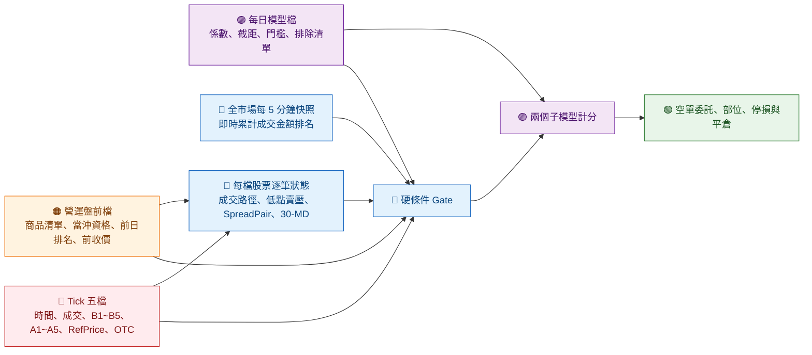

# timeSeriesResearch：negFill 比較訊號

> 文件目的：讓 RD 可以直接理解 negFill 的策略意圖、資料來源、逐筆資料流、訊號條件、模型計分與委託生命週期。
>
> 本文件描述的是策略行為，不限定實作語言。所有逐筆狀態都必須以「交易日 × 股票」隔離，換日重置。
>
> 本專案以 negFill 作為固定訊號範本，比較 raw、market-relative 與 beta-residual 等 time-series 研究做法。
>
> 本文件以當日模型參數檔、`modelUpdate.py` 與 `time_series_research_model` 的最終訊號 cell 為核對基準；若三者不一致，會在第 11.5 節明確列為待同步項目，不把實驗中間值當成正式設定。

## 專案入口與 beta 資料契約

- `build_index.py`：產生固定 negFill 事件的 `data_index.parquet`。
- `data_loader.py`：merge tickData、tickFeature、preMarketData、tickBar 與 TXF label，輸出 `data/{Date}.parquet`。
- `time_series_research_model.py`：現有 rolling Ridge 比較 baseline；新增的 TXF return 與 beta 欄位供後續建立 beta-residual label。
- `time_series_research.ipynb` / `time_series_research_model.ipynb`：互動研究筆記本。

`data_loader.py` 的 TXF 契約：

- 本地 `data/txfTickData/{Date}_TxfTick.parquet` 存在時優先使用。
- 本地不存在時先嘗試 `sdk_core.TwBranchData.get_txf_only`；現行 SDK 未提供該方法時，相容回退到 `sdk_core.TwTicks.get_txf_only`。
- 事件 entry 只使用不晚於 `TransTime` 的最近 L1，預設容忍 10 秒
  （`TXF_ENTRY_TOLERANCE`）。原本是 2 秒，但 SDK 補的日子只有成交價：
  報價在沒成交時仍會更新、成交不會，2 秒會讓 2025 段掉約 16% 的事件，
  而且缺失集中在冷清時段、不是隨機。放寬到 10 秒可回到約 99.7%，
  新鮮度幾乎不變（entry age 中位數 0.60s → 0.69s、p95 1.7s → 3.4s），
  真實 L1 日不受影響。實際 entry 延遲一律記在 `txf_entry_quote_age_us`，
  要更嚴格可自行依該欄後篩。
- close 使用不晚於 13:30 的最後 L1，最大容忍 60 秒。
- 主要欄位為 `txf_entry_mid`、`txf_close_mid`、`txf_to_1330_return`、`txf_to_1330_bp`、`txf_contract`、`txf_source` 與 quote-time audit 欄位。

#### TXF 覆蓋率與資料接縫

NAS `/mnt/NAS/Parquet/Ticks/{Y}/{M}/{D}/txf_only.parquet` 只有 2024-06-24
一天與 2026-01 之後的日子，所以 `TwTicks.get_txf_only` 補不到 2025。
`script/backfill_txfTickData.py` 用 `sdk_core.TwFuturesL1.get_txf_only`
補齊，該 API 至少可回溯到 2023-01。三種來源寫在每個檔案的
`QuoteSource` 欄位，`load_day` 會把它回報成 `TxfDay.source`：

| `QuoteSource` | 內容 | mid 的定義 |
|---|---|---|
| `local_tick` | 原有本地五檔 L1 | `(BidPrice1 + AskPrice1) / 2` |
| `nas_txf_only_l1` | NAS 真實五檔 L1 | 同上 |
| `sdk_futures_l1_trades` | `TwFuturesL1` 成交價，合成 L1 | **最後成交價** |

`sdk_futures_l1_trades` 沒有 bid/ask，以成交價同時填入
`BidPrice1`／`AskPrice1`，因此 mid 等於最後成交價而非報價中點。這是
真實的資料接縫，但影響有限：本地 L1 的 `TransTime` 本來就是秒級，
與 SDK 相同；且在事件到 13:30 這種數小時 horizon 上，TXF 的
bid-ask bounce 約 1 點、不到 1 bp。

`script/validate_txfTickData.py` 以 `marketData` 中 `ins_type == "stock"`
的 open-to-close 橫斷面中位數作獨立對照（不可用全體，因為 marketData
約 94% 是權證，中位數會被沒成交的權證壓成 0）。實測合成日與真實 L1
日的行為一致：corr `0.731` vs `0.734`，beta `0.890` vs `1.169`。

價格一律存成 points × 100 的 Int32，`_detect_price_scale` 依中位數
是否大於 `100000` 自動判斷；QuoteCode 沿用 TAIFEX 月碼
`TXF + 月字母(A=1..L=12) + 年末碼`，例如 `202506` → `TXFF5`。

preMarketData 每檔商品只加入 `txf_beta_60d` 與
`txf_residual_vol_0900_1330_60d`。兩者使用最近 60 個已完成交易日的
股票 open-to-close 與 TXF 09:00-to-13:30 return，至少 20 筆；beta
向 1.0 shrink 後限制在 `[-0.5, 2.0]`，residual vol 則是使用同一個
applied beta 計算的 residual return 標準差。資料不足時 beta 使用 1.0、
vol 保持 null，不另外輸出 fallback 或 audit 欄位。因此
`txf_beta_60d == 1.0` 實務上就等於 fallback（shrink 後剛好落在 1.0
的機率是零），`vol` 為 null 也是同一件事的另一個指標。

#### 鎖死的個股日不進 beta 歷史

歷史建構會排除 `high_price == low_price` 的個股日。那種日子沒有價格
發現，open-to-close 報酬是機械性的 `0`，配上非零的市場報酬會直接教
迴歸「這檔 beta 是 0」。過濾在**個股 × 日**層級，不是把整個交易日
列入黑名單 —— 2025-04-09 那種期現貨同步的高波動日，資訊量最大、對
beta 估計的槓桿也最高，只該剔掉當天真正鎖死的那 6%，不該整天丟掉。
`marketData` 若沒有 high/low 欄位則不過濾，維持舊行為。

實測影響（2025-04 關稅那段，事件母體內的股票）：beta 中位數幾乎不動
（|Δ| p50 約 0.0015），p95 約 0.11–0.21，均值微幅上移約 +0.02；
residual vol 上升約 0.5–1.1%，因為原本被人為為 0 的殘差壓低了標準差。

副作用是全市場可用 beta 減少約三成（`vol` 非 null 從約 58% 降到 41%），
因為 `high == low` 也會抓到整天只成交在單一價位的冷門股，那種商品
60 天裡可能有 40 天被剔除而掉到 20 筆門檻以下。但**事件樣本的覆蓋率
仍是 100%**（含 `rank <= 100` 子集），損失全落在從不進事件資料的
權證與冷門股 —— 它們原本的 beta 也只是雜訊，退回 fallback 較誠實。

#### 合併層只接資料，不算 label

`data_loader.py` 的職責和 negFill／followHFTMaker 一致：把 tickData、
tickFeature、preMarketData、tickBar 與 TXF 接起來，輸出原始欄位。
它**不產生任何 net return 或 label**。beta 與 vol 屬於
preMarketData 的欄位，TXF 只進 `data/txfTickData`；`tickData` 與
`tickFeature` 全程唯讀，不因這條研究線改寫。

要自行計算 net return 的話，合併後這四個原料都直接可用：

| 角色 | 欄位 | 說明 |
|---|---|---|
| return | `txf_to_1330_return` | 事件當下到 13:30 的 TXF 報酬 |
| beta | `txf_beta_60d` | 盤前 60 日 applied beta |
| vol | `txf_residual_vol_0900_1330_60d` | 盤前完整時段 residual vol |
| remainTime | `RemainSeconds_1330` | 事件到 13:30 的秒數，已 clip 到 `[0, 16200]` |

注意 `RemainSeconds_1330` 與既有的 `RemainSeconds` **不是同一個
horizon**：後者算到 13:25，是 tickFeature 的既有欄位，不要混用。

事件資料另有 `txf_residual_vol_to_1330`：以盤前完整時段 residual vol
乘上一個只依時間的 intraday variance clock。這個轉換直接使用
`TransTime`，不使用既有到 13:25 的 `RemainSeconds`。它是由
`RemainSeconds_1330` 直接算出來的，所以自己重算時用同一欄就會完全一致；
要換掉這個 scale 也只需要改用 `RemainSeconds_1330` 重新套自己的函式。

```text
x     = clip(事件到 13:30 的秒數 / 16200, 0, 1)
scale = sqrt(x) × (1.1177218 - 1.4889296x + 1.3712078x²)

txf_residual_vol_to_1330 = txf_residual_vol_0900_1330_60d × scale
```

三個係數相加恰為 `1`，所以 09:00 的 `scale = 1`、13:30 的 `scale = 0`；
導數分子 `3.4280195x² - 2.2333944x + 0.5588609` 判別式為負，因此在
`(0, 1]` 上嚴格單調遞增。函式為 `src/features/market_beta.py` 的
`residual_vol_time_scale`，同時吃 float、numpy array 與 polars expression。

校準方式：2024 年全市場可當沖商品的每 5 分鐘到收盤報酬，逐
`(Date, TimeSlot)` 扣除 cross-sectional median，再以 median absolute
return 當 robust vol scale；2025、2026 作樣本外驗證。原本的平方根時間
主要高估 09:15～12:30 的剩餘 vol，RMSE 在 2025／2026 為 `0.142`／`0.179`，
本式為 `0.020`／`0.033`，單一 power law 在 2026 只到 `0.104`。

此式只依賴時鐘時間，不讀當日行情、也不使用 negFill 樣本，因此不會
把樣本內資訊帶進事件層。最後一個校準錨點在 13:00；`x < 0.085853`
（13:06:49 之後）曲線會回到平方根之上，屬外插區，但訊號窗在 12:00
截止（`x ≥ 1/3`），正式流程不會取到該段。preMarket schema 不受影響。

---

## 1. 先用一句話理解策略

negFill 想找的是：

**某檔股票在日內低點附近持續出現偏賣方的成交流，價差曾經張開一段時間，之後 B1 與價差再次變動；若當下價格、流動性與模型分數都合格，就用被動限價單建立空單。**

策略分成五層：

1. 盤前決定今天能觀察、能當沖的股票，並載入模型參數。
2. 開盤後用前一日熱門股的開盤表現，決定今天使用 normal 或 abnormal 模型組。
3. 每一筆 Tick 更新成交路徑、低點賣壓、價差事件及最近 30 筆市場活躍度。
4. 硬條件全部通過後，再讓兩個子模型一起表決。
5. 兩個模型都通過才掛空單；盤中負責停損，尾盤強制平倉。

目前稽核結論：九個模型 feature 的最終值可與研究模型對齊；其中 `ToRef`、`ToOpen` 必須覆寫 parquet 的 mid-price 原值。整體流程另有 rate Gate、最終風控、當日當沖資格來源、`Open` 可得時間與缺值補法等 research/live 差異，詳見第 11.5 節。

---

## 2. 資料來源顏色圖例

本文每個欄位前都用固定標籤表示資料從哪裡來：

| 標籤 | 類型 | 定義 |
|---|---|---|
| <span style="color:#c62828;font-weight:700">● [TICK]</span> | Tick 逐筆輸入 | 策略從 `tickData` 每筆直接讀到的時間、成交、五檔價量、試撮狀態，以及已附在 Tick 上的 `RefPrice`、`OTC`。前者是交易所行情，後兩者是上游補入的商品資料，但對 negFill 都屬直接 Tick 輸入。 |
| <span style="color:#ef6c00;font-weight:700">● [PRE]</span> | 盤前資料 | 08:15 前已準備好的商品靜態資料、前一交易日統計、當沖資格與觀測清單。 |
| <span style="color:#1565c0;font-weight:700">● [CALC]</span> | 策略計算資料 | 由 Tick、盤前資料或全市場快照計算出的狀態、特徵、排名與布林條件。 |
| <span style="color:#6a1b9a;font-weight:700">● [MODEL]</span> | 模型檔資料／輸出 | 每日模型 JSON 直接提供的 `suspended_list`、`target_list`、係數、截距、門檻，以及計算後的模型分數。 |
| <span style="color:#2e7d32;font-weight:700">● [ORDER]</span> | 委託與部位狀態 | 策略自己的未成交單、成交量、空單部位、停損狀態。 |
| <span style="color:#455a64;font-weight:700">● [PARAM]</span> | 策略設定 | 時間、排名、價格、流動性、部位與停損門檻；正式值集中在第 13 節。 |

如果閱讀環境沒有顯示 HTML 顏色，仍可依 `[TICK]`、`[PRE]`、`[CALC]`、`[MODEL]`、`[ORDER]`、`[PARAM]` 文字辨識來源。

### 2.1 完整欄位與狀態來源索引

下表是本策略會用到的完整變數索引。凡是現有資料已經有欄名，一律使用原欄名，不建立另一個策略別名。

| 類型 | 變數原名 | 實際來源 | 備註 |
|---|---|---|---|
| <span style="color:#c62828;font-weight:700">[TICK]</span> | `QuoteCode`, `ChannelSeq`, `TransTime`, `TrialMatch` | `tickData` | 商品、順序、時間與試撮狀態。 |
| <span style="color:#c62828;font-weight:700">[TICK]</span> | `BidPrice1…5`, `BidLots1…5`, `AskPrice1…5`, `AskLots1…5` | `tickData` | 五檔價量。 |
| <span style="color:#c62828;font-weight:700">[TICK]</span> | `FillPrice`, `FillLots`, `FillLots_origin`, `InOut` | `tickData` | 成交價、處理後成交量、原始成交量與成交方向；`FillLots` 已由 tick pipeline 將試撮量歸零，`FillLots_origin` 只供追溯。 |
| <span style="color:#c62828;font-weight:700">[TICK]</span> | `RefPrice`, `OTC` | `tickData` | 上游已附在逐筆資料上的參考價與市場別。 |
| <span style="color:#ef6c00;font-weight:700">[PRE]</span> | `QuoteCode`, `allow_day_trade_mark`, `PreviousClosePrice`, `day_amount_rank`, `hft_strick_makerSpreadBP`, `avg_bidLots1`, `avg_askLots1` | `src/strategy/preMarket/{TradeDate}_preMarketData.parquet` | 檔名是使用日，但欄位由前一交易日資料產生；`allow_day_trade_mark` 也屬前一日，不能當成當日 T30 資格。 |
| <span style="color:#ef6c00;font-weight:700">[PRE]</span> | `allow_day_trade_mark` | 使用日當天的 `marketData`／等價商品主檔 | 與上一列同名但來源日期不同；研究流程用這一份判斷當日是否可當沖。RD 必須用來源日期區分，不能另改欄名。 |
| <span style="color:#1565c0;font-weight:700">[CALC]</span> | `marketOpen`, `Open`, `RecordHigh`, `RecordLow` | `src/features/definitions/basic_info.py`；研究資料存於 `tickData` | 上游先算好再寫進 `tickData`，不是交易所原始欄位。 |
| <span style="color:#1565c0;font-weight:700">[CALC]</span> | `ToLow`, `ToHigh`, `Low_High`, `BidPreMove`, `TickSize`, `FillLots_atLow` | `src/features/definitions/price_dynamics.py`；研究資料存於 `tickFeature` | 模型、候選事件或風控依各自用途沿用 parquet 值。 |
| <span style="color:#1565c0;font-weight:700">[CALC]</span> | `ToRef`, `ToOpen` | parquet 原值來自 `price_dynamics.py`，模型載入後再覆寫 | parquet 用 mid price；negFill 模型最終用 `BidPrice1` 並四捨五入至 6 位。 |
| <span style="color:#1565c0;font-weight:700">[CALC]</span> | `B1_A1B1`, `Spread`, `SpreadPairID`, `SpreadPairAsk`, `SpreadPairBid`, `SpreadPairSeq`, `SpreadPairElapsed` | `src/features/definitions/orderbook.py`；研究資料存於 `tickFeature` | 模型／候選事件直接沿用 parquet 值。 |
| <span style="color:#1565c0;font-weight:700">[CALC]</span> | `SpreadNarrowOrderTime`, `SpreadPairTotalCount`, `SpreadCountAtSameCount`, `SpreadNarrowSide` | `src/features/definitions/orderbook.py`；研究資料存於 `tickFeature` | 只在收盤後產製 `hft_strick_makerSpreadBP` 時使用。 |
| <span style="color:#1565c0;font-weight:700">[CALC]</span> | `Close`, `FutureHigh`, `FutureLow` | `src/features/definitions/basic_info.py`；研究資料存於 `tickData` | 含收盤後／未來資訊，只可產製次日盤前特徵，絕不可作為當日逐筆模型輸入。 |
| <span style="color:#1565c0;font-weight:700">[CALC]</span> | `RemainSeconds` | `src/features/definitions/time_features.py`；研究資料存於 `tickFeature` | 整數秒。 |
| <span style="color:#1565c0;font-weight:700">[CALC]</span> | `MD_L1Rate_30`, `MD_ElaspeTime_30` | `src/features/definitions/microstructure.py`；研究資料存於 `tickFeature` | 模型沿用比例，並將 elapsed 另做 `ln(1+x)`。 |
| <span style="color:#1565c0;font-weight:700">[CALC]</span> | `AmountRank_canDayTrade` | `tickBar`／全市場每 5 分鐘計算 | 當日截至目前的可當沖商品成交金額排名。 |
| <span style="color:#1565c0;font-weight:700">[CALC]</span> | `MD_ElaspeTime_30_re` | `ln(1 + MD_ElaspeTime_30)` | 模型使用的轉換值；名稱沿用模型 schema。 |
| <span style="color:#1565c0;font-weight:700">[CALC]</span> | `MD_L1Rate_30_re` | `time_series_research_model`／`modelUpdate.py` 令它等於 `MD_L1Rate_30` | 研究流程的同值暫存別名；正式模型 feature list 與模型 JSON 對接仍使用 `MD_L1Rate_30`。 |
| <span style="color:#1565c0;font-weight:700">[CALC]</span> | `RecentFillPrice`, `SignedFillLots`, `spreadChanged`, `b1Changed`, `negativeFill`, `candidateEvent` | 策略依 Tick 逐筆維護 | 這些不是上游資料欄位，而是為了說明流程使用的內部狀態。 |
| <span style="color:#1565c0;font-weight:700">[CALC]</span> | `toOpen`, `topOpen`, `validCount`, `isTop100`, `preMarketUniverse`, `candidateUniverse`, `eligibleUniverse` | 策略由 Tick、盤前檔、排名與模型清單計算 | `toOpen`、`topOpen` 沿用 `modelUpdate.py` 名稱；其餘是集合、統計或 Gate 狀態，不要求上游提供同名欄位。注意模型 feature `ToOpen` 是另一個大小寫不同的欄位。 |
| <span style="color:#1565c0;font-weight:700">[CALC]</span> | `distance`, `depth`, `SpreadPairStartTime`, `elapsedSeconds`, `hasFill`, `windowCount` | 各特徵公式的內部暫存值 | 不寫回上游資料；`SpreadPairStartTime` 只用來算既有欄位 `SpreadPairElapsed`。 |
| <span style="color:#1565c0;font-weight:700">[CALC]</span> | `Amount`, `TimeSlot`, `_amt`, `_day_amount` | `crossSection.py`、`preMarketSummary.py` | 排名計算的既有欄位或上游暫存欄位；公式見第 5.4 節。 |
| <span style="color:#1565c0;font-weight:700">[CALC]</span> | `open_price`, `opening_ref_price`, `allow_day_trade_mark_x` | `data/marketData` 與外層 `data/preMarket` 合併結果 | 只供 `modelUpdate.py` 離線建立 `topOpen`／`abnormal_dates`；不是營運盤前檔的線上契約。 |
| <span style="color:#1565c0;font-weight:700">[CALC]</span> | `activeModelA`, `activeModelM`, `allModelFeaturesValid`, `passGate`, `scoreA`, `scoreM`, `passModelA`, `passModelM`, `passModels` | 模型選擇、Gate 與計分流程 | 這些是策略內部結果，不是輸入欄位。 |
| <span style="color:#1565c0;font-weight:700">[CALC]</span> | `accLots`, `Position` | `time_series_research_model` 最終風控 cell | `accLots` 是當日同商品累計模型訊號筆數；`Position` 是每筆視為一張時的累計名目部位，單位萬元。 |
| <span style="color:#6a1b9a;font-weight:700">[MODEL]</span> | `suspended_list`, `target_list`, `normal_model`, `normal_model_M`, `abnormal_model`, `abnormal_model_M` | `src/strategy/negFill/modelParam/{TradeDate}_modelParams.json` | 每日模型檔頂層欄位。 |
| <span style="color:#6a1b9a;font-weight:700">[MODEL]</span> | `coefficients`, `intercept`, `threshold` | 上述四個模型區塊 | 逐筆模型計分參數。 |
| <span style="color:#6a1b9a;font-weight:700">[MODEL]</span> | `metadata.trained_until`, `metadata.alpha`, `metadata.otc_turnover_threshold` | 模型檔 `metadata` | 模型版本與訓練資訊，不直接進逐筆分數。 |
| <span style="color:#2e7d32;font-weight:700">[ORDER]</span> | `entryPrice`, `entryLots`, `projectedPosition`, `shortPosition`, `stoppedOutToday`, working order ID／價格／剩餘量 | 策略委託與成交回報 | 這些不是行情資料欄位，由交易狀態機維護。 |
| <span style="color:#455a64;font-weight:700">[PARAM]</span> | 第 13 節全部門檻 | 策略設定或模型檔 | 每一個參數的正式值與用途都只在第 13 節定義。 |

文中的「B1／A1」只是閱讀用簡稱，永遠分別代表現有欄位 `BidPrice1`／`AskPrice1`；資料介面不可另外建立 `B1`、`A1` 欄位。

---

## 3. 全策略資料流



### 3.1 每筆 Tick 的處理順序

每收到一筆行情，固定照以下順序處理：

1. 讀取 <span style="color:#c62828;font-weight:700">[TICK]</span> 行情並確認不是重複、倒序或跨日資料。
2. 更新 <span style="color:#1565c0;font-weight:700">[CALC]</span> 開盤價、最近成交價、日內高低點與低點累積買賣流。
3. 更新 <span style="color:#1565c0;font-weight:700">[CALC]</span> Spread、SpreadPair 與最近 30 筆 MD 特徵。
4. 計算九個模型特徵。
5. 執行硬條件 Gate；任一條失敗就結束這一筆。
6. 依當日市場狀態選擇模型組，計算兩個子模型分數。
7. 兩個子模型都通過，且部位仍有空間，才建立或修改放空委託。
8. 收到成交回報後，更新 <span style="color:#2e7d32;font-weight:700">[ORDER]</span> 空單部位。

---

## 4. 每日時間軸

| 時間 | 動作 | 主要輸入 | 產出與目的 |
|---|---|---|---|
| 08:15 | 盤前初始化 | <span style="color:#ef6c00;font-weight:700">[PRE]</span> 當日營運盤前檔、當日 T30／商品主檔資格；<span style="color:#6a1b9a;font-weight:700">[MODEL]</span> 當日模型檔 | 由盤前檔建立觀測商品與前日 Top 100；由當日資格來源決定能否放空；由模型檔取得 `suspended_list`、`target_list` 及四個模型參數。 |
| 09:00 起 | 收集開盤價 | <span style="color:#c62828;font-weight:700">[TICK]</span> 第一筆有效成交 | 更新各股票的 <span style="color:#1565c0;font-weight:700">[CALC]</span> `Open`，並計算 `toOpen`；不要與模型 feature `ToOpen` 混用。 |
| 09:00:15 | 選擇今日模型組 | <span style="color:#ef6c00;font-weight:700">[PRE]</span> 前日 Top 100；<span style="color:#1565c0;font-weight:700">[CALC]</span> `topOpen` | `topOpen < 0.0025` 用 abnormal 模型組，否則用 normal 模型組。 |
| 每 5 分鐘 | 更新今日熱門股 | <span style="color:#1565c0;font-weight:700">[CALC]</span> 全市場截至當下累計成交金額 | 更新 `AmountRank_canDayTrade`；兩次更新之間沿用最近一次排名。 |
| 09:00:30～12:00 | 允許建立空單 | Tick、盤前欄位、計算特徵與模型 | 只有嚴格大於 09:00:30、嚴格小於 12:00:00 的 Tick 可觸發新空單。 |
| 盤中 | 停損 | 最新有效成交價、`RefPrice`、空單部位 | 價格突破 `RefPrice × 1.08` 時，取消開倉賣單並以 taker 買回全部空單。 |
| 12:00 | 停止開倉 | 時鐘、未成交開倉單 | 不再接受新訊號；取消仍未成交的開倉賣單。 |
| 12:45 | Maker 平倉 | B1、剩餘空單 | 取消開倉賣單，在當下 B1 掛 ROD 買單回補剩餘空單。 |
| 13:14 | Taker 平倉 | 剩餘空單 | 取消未成交的 maker 回補單，以 taker 買回全部剩餘空單。 |

---

## 5. 輸入資料契約

### 5.1 Tick 逐筆直接輸入

以下欄位全部是 <span style="color:#c62828;font-weight:700">[TICK]</span>，negFill 從每筆 `tickData` 直接取得。`RefPrice`、`OTC` 雖由上游商品資料附加，策略本身不再從盤前檔重算：

| 欄位 | 意義 | 策略用途 |
|---|---|---|
| `QuoteCode` | 股票代碼 | 所有逐筆狀態的分組鍵。不同股票絕不可共用狀態。 |
| `ChannelSeq` | 行情序號 | 同股票同交易日的去重與順序檢查。 |
| `TransTime` | 交易所事件時間 | 交易時段判斷、SpreadPair 計時、30-MD 經過時間與剩餘秒數。 |
| `TrialMatch` | 是否為試撮 | `0` 才是正常盤中行情；試撮不更新正式成交狀態，也不可產生訊號。 |
| `BidPrice1…5` | 買方一至五檔價格 | B1 用於訊號、模型及委託價；其餘檔位保留給行情完整性與未來特徵。 |
| `BidLots1…5` | 買方一至五檔掛單量 | 目前模型使用 `BidLots1`。 |
| `AskPrice1…5` | 賣方一至五檔價格 | A1 用於 Spread、模型與空單委託價。 |
| `AskLots1…5` | 賣方一至五檔掛單量 | 目前模型使用 `AskLots1`。 |
| `FillPrice` | 當筆成交價；沒有成交時為 `0` | 更新最近成交價、開盤價、日內高低點及停損。 |
| `FillLots` | 當筆成交張數；沒有成交時為 `0` | 計算成交封包比例及累積買賣流。成交量本身不帶方向。 |
| `InOut` | 成交方向 | `+1` 代表買方主動成交、`-1` 代表賣方主動成交、`0` 代表本筆沒有可計入的方向。 |
| `RefPrice` | 當日開盤參考價 | 計算 `ToRef`、`ToLow`、`ToHigh`、進場價格範圍、`topOpen` 與停損線。研究用 `tickData` 已直接帶有此欄。 |
| `OTC` | 是否為上櫃商品 | 決定是否略過上市股票的 `MD_L1Rate_30` Gate。研究用 `tickData` 已直接帶有此欄。 |

`tickData` 在寫 parquet 前已做以下上游處理；線上重現 feature 時也要使用處理後語意：

```text
所有 *Price* 欄位 = 上游整數價格 / 10000
FillLots_origin    = 上游原始 FillLots
FillLots           = FillLots_origin × (TrialMatch == 0)
RefPrice            = marketData.opening_ref_price
OTC                 = (marketData.market == "otc")
marketOpen          = (TrialMatch == 0) 從第一次成立後的累積 OR
```

之後 `tickFeature` 只保留 `marketOpen == true` 的 Tick，再依 `price_dynamics → orderbook → time_features → microstructure` 等 feature group 順序計算。因此最近 30 筆是「開盤狀態成立後的 Tick」，不包含盤前試撮列。

Tick 價格或數量無效時的處理：

- `BidPrice1 <= 0`、`AskPrice1 <= 0` 或 `AskPrice1 < BidPrice1`：本筆不可產生訊號。
- 任一使用到的委託量小於 `0`：視為壞資料，本筆不可進模型。
- 同一 `(交易日, QuoteCode, ChannelSeq)` 重複：忽略第二筆以後的資料。
- 同股票時間或序號倒退：忽略且告警，不可寫入逐筆狀態。

### 5.2 盤前檔輸入

線上直接讀取的檔案是：

```text
src/strategy/preMarket/{TradeDate}_preMarketData.parquet
```

這份檔案由前一交易日的 `marketData + tickData + tickFeature` 彙整後產生，再以「下一個交易日」命名。例如 `20260813_preMarketData.parquet` 是用 2026-08-12 收盤後的資料產生，供 2026-08-13 盤前使用。

已實際比對 `src/strategy/preMarket/20260813_preMarketData.parquet`：共 `42,744` 筆，其 `allow_day_trade_mark` 與 `data/marketData/20260812_marketData.parquet` 在全部商品上完全相同，確認該欄是來源日資料，不是 2026-08-13 當日資格。

以下是 negFill 會直接使用的 <span style="color:#ef6c00;font-weight:700">[PRE]</span> 欄位；名稱以實際營運檔 schema 為準：

| 實際欄名 | 策略內名稱 | 意義與用途 |
|---|---|---|
| `QuoteCode` | `QuoteCode` | 商品代碼，也是盤前檔與 Tick／模型清單的 join key。盤前檔中的所有 `QuoteCode` 合起來就是 `preMarketUniverse`，不是另有一個同名欄位。 |
| `allow_day_trade_mark` | `allow_day_trade_mark` | **來源交易日**的當沖註記。因檔案以次交易日命名，這不是使用日當天的最終資格；只可追溯或預篩，不可單獨決定今日能否放空。 |
| `PreviousClosePrice` | `PreviousClosePrice` | 前一交易日收盤價。它用來產生模型檔的高價股排除清單，也可在盤前檢核 Tick 的 `RefPrice`；逐 Tick 公式仍使用 Tick 的 `RefPrice`。 |
| `day_amount_rank` | `day_amount_rank` | 前一完整交易日的成交金額排名，`1` 表示金額最大。用來建立盤前 Top 100。 |
| `hft_strick_makerSpreadBP` | 同名 | 前一交易日的 HFT maker spread 統計。模型產製程序用它建立 `suspended_list`，研究 notebook 最終風控也直接要求它為 null 或嚴格大於 `-70`。 |
| `avg_bidLots1` | 同名 | 前一交易日 `BidLots1` 平均值；研究 notebook 用於限制同商品累計訊號筆數。 |
| `avg_askLots1` | 同名 | 前一交易日 `AskLots1` 平均值；與 `avg_bidLots1` 相加形成累計訊號筆數上限。 |

盤前檔實際還有 `big_buy_*`、`big_sell_*`、其他 `hft_*`、`negFill_*`、`day_lots_rank` 等研究特徵；目前九個逐筆模型特徵與最終風控沒有直接使用這些其餘欄位。

上述三個盤前風控 feature 在 `src/features/preMarketSummary.py` 的實際算法：

```text
avg_bidLots1 = 前一日 marketOpen Tick 的 mean(BidLots1)
avg_askLots1 = 前一日 marketOpen Tick 的 mean(AskLots1)

hft 候選列：
    SpreadNarrowOrderTime < 0.07
    AND SpreadCountAtSameCount == 0
    AND abs(SpreadPairElapsed - SpreadNarrowOrderTime) < 0.000001

賣側樣本：SpreadNarrowSide == -1、AskPrice1 != 0、AskPrice1 <= FutureHigh
買側樣本：SpreadNarrowSide ==  1、BidPrice1 != 0、BidPrice1 >= FutureLow

把買、賣兩側樣本數補到相同；數量較少的一側以當日 Close 補值
A_mean = 補值後賣側 AskPrice1 平均
B_mean = 補值後買側 BidPrice1 平均

hft_strick_makerSpreadBP = (A_mean - B_mean) / B_mean × 10000
```

`FutureHigh`、`FutureLow`、`Close` 都要等來源日結束才完整，因此這個 HFT feature 只能在收盤後產生、供次日使用；盤中不可重算當日值。

使用日當天的 `marketData.allow_day_trade_mark` 不是目前 `preMarketData.parquet` 內那一份前日同名值，必須由當日商品主檔或語意相同的 T30 來源提供。正式可當沖條件應以使用日當天的結果為準：

```text
可當沖 = 使用日當天的 allow_day_trade_mark == "X"
```

若當日資格來源缺失，策略不得只拿盤前檔內的前日 `allow_day_trade_mark` 代替；應停止建立新空單並告警。

#### 外層歷史盤前檔不是線上輸入契約

研究資料另有：

```text
data/preMarket/{Date}_preMarketData.parquet
```

它同樣由來源日資料產生並以次交易日命名，但比營運盤前檔多出 `market`、`ins_type`、`nextday_allow_day_trade_mark`、`turnover_rate`、`turnover_rate_rank` 等欄位。`modelUpdate.py` 以檔名日期把它與當日 `marketData` 合併，因此 `day_amount_rank` 是前日排名，而 `allow_day_trade_mark_x` 來自當日 `marketData`。這些額外欄位可供離線研究或模型產製使用，但在實際檢查的營運盤前檔 `src/strategy/preMarket/20260813_preMarketData.parquet` 中不存在。因此 RD 不可假設線上盤前檔有它們；是否為 OTC 應直接讀 Tick 的 `OTC`。

### 5.3 每日模型檔輸入

線上直接讀取：

```text
src/strategy/negFill/modelParam/{TradeDate}_modelParams.json
```

以下全部是 <span style="color:#6a1b9a;font-weight:700">[MODEL]</span>，不是 `[PRE]`：

| 實際欄位 | 策略內名稱 | 意義與用途 |
|---|---|---|
| `suspended_list` | `suspended_list` | 當日不可交易的 `QuoteCode` 清單；即使盤前檔與其他 Gate 都通過也必須排除。 |
| `target_list` | `target_list` | 額外目標商品清單。目前模型產製程式將它輸出為空陣列，等於功能未啟用。 |
| `normal_model` | 同名 | normal 日主要模型 A 的係數、截距與門檻。 |
| `normal_model_M` | 同名 | normal 日確認模型 M 的係數、截距與門檻。 |
| `abnormal_model` | 同名 | abnormal 日主要模型 A 的係數、截距與門檻。 |
| `abnormal_model_M` | 同名 | abnormal 日確認模型 M 的係數、截距與門檻。 |

`suspended_list` 的資料血緣為：

```text
[PRE] hft_strick_makerSpreadBP、PreviousClosePrice
    ↓ 模型產製程序
[MODEL] suspended_list
    ↓ 盤中策略只讀模型結果，不再自行重算
```

目前模型產製規則：

```text
加入 suspended_list
    if hft_strick_makerSpreadBP < -70
    OR PreviousClosePrice > 1000
```

也就是說，來源特徵來自盤前檔，但策略收到的直接欄位是模型 JSON 的 `suspended_list`，所以文件與流程圖一律標為 <span style="color:#6a1b9a;font-weight:700">[MODEL]</span>。

盤前可交易集合：

```text
candidateUniverse = preMarketUniverse ∪ 已啟用的 target_list

eligibleUniverse
    = candidateUniverse
    ∩ 使用日當天 allow_day_trade_mark == "X" 的商品
    - suspended_list
```

`target_list` 加入後仍必須通過當沖資格、行情有效性、Gate、模型與部位限制，不代表直接下單。

### 5.4 全市場即時計算資料

`AmountRank_canDayTrade` 是 <span style="color:#1565c0;font-weight:700">[CALC]</span>，不是單一股票 Tick 直接帶入：

```text
Amount[stock, tick]
    = 從當日第一筆到目前為止累加
      FillLots × FillPrice × (TrialMatch == 0)

TimeSlot = 09:00、09:05、...、13:20

每個 TimeSlot：
    1. 每檔股票取 TransTime <= TimeSlot 的最後一筆 Amount
    2. 當日 marketData 的 allow_day_trade_mark == "X" 才參與排名，其餘為 null
    3. 依 Amount 由大到小做 ordinal rank
    4. 最大者 AmountRank_canDayTrade = 1
```

`ordinal rank` 表示金額相同時仍會依資料順序得到不同名次，不是同名次排名。研究資料把上述 5 分鐘快照的 `TransTime` 加 `1µs` 後，再用 backward as-of join 回候選 Tick；RD 若要完全重現 parquet，join 時序也必須一致。

<span style="color:#ef6c00;font-weight:700">[PRE]</span> `day_amount_rank` 則是收盤後的前一日全日排名：

```text
_amt[each tick]    = FillLots × FillPrice
_day_amount[stock] = 前一完整交易日 Σ(_amt)
day_amount_rank    = _day_amount 由大到小做 min rank
```

`min rank` 表示成交金額相同時共用同一名次。營運盤前檔以次一交易日命名，所以盤中拿到的是前一完整交易日的結果。

策略使用：

```text
isTop100 = day_amount_rank <= 100
           OR AmountRank_canDayTrade <= 100
```

這個聯集的目的，是同時保留「昨天已經熱門」與「今天盤中突然變熱門」的股票。`AmountRank_canDayTrade` 只能使用當下以前的成交資料，不能使用收盤後的全日排名。

---

## 6. 每檔股票的逐筆計算狀態

### 6.1 有效成交與價格路徑

`src/features` 對 OHLC 與最近成交價使用兩個非常接近、但不完全相同的條件；實作時不可自行合成第三個條件：

```text
OHLC 有效價條件       = TrialMatch == 0 AND FillPrice != 0
RecentFillPrice 更新條件 = FillPrice > 0
```

`RecentFillPrice` 的計算輸入已先被 `marketOpen == true` 過濾，而上游 `FillLots` 也已把 `TrialMatch != 0` 的量設為 `0`。現行算法沒有要求 `FillLots != 0` 才更新價格路徑。

每檔股票維護下列 <span style="color:#1565c0;font-weight:700">[CALC]</span> 狀態：

| 欄位 | 更新方式 | 想表達的市場意義 |
|---|---|---|
| `Open` | 每檔股票第一筆符合 `TrialMatch == 0 AND FillPrice != 0` 的 `FillPrice`，一旦取得後當日不再改變 | 今日開盤成交價；欄名沿用現有資料的 `Open`。 |
| `RecentFillPrice` | `FillPrice > 0` 時更新，沒有成交的 Tick forward-fill；尚無成交時 fallback `RefPrice` | `ToLow`／`ToHigh` 實際使用的基準價。 |
| `RecordLow` | 符合 OHLC 有效價條件之 `FillPrice` 的逐筆累計最小值 | 目前為止的成交低點。 |
| `RecordHigh` | 符合 OHLC 有效價條件之 `FillPrice` 的逐筆累計最大值 | 目前為止的成交高點。 |

今日尚未出現有效成交前：

- `RecentFillPrice` 可先以 `RefPrice` 初始化。
- `Open`、`RecordLow`、`RecordHigh` 視為尚未有效，不能送入模型。
- 第一筆有效成交後，`Open = RecentFillPrice = RecordLow = RecordHigh = FillPrice`。

### 6.2 價格位於日內高低點的哪裡

以下三個都是 <span style="color:#1565c0;font-weight:700">[CALC]</span> 模型特徵：

```text
ToLow  = abs(RecentFillPrice - RecordLow)  / RefPrice
ToHigh = abs(RecentFillPrice - RecordHigh) / RefPrice

distance = ToLow + ToHigh
Low_High = 0.5                 if distance == 0
           ToLow / distance    otherwise
```

| 特徵 | 用途 |
|---|---|
| `ToLow` | 最近成交離日內低點多遠。越小表示越貼近低點。 |
| `ToHigh` | 最近成交離日內高點多遠。越小表示越貼近高點。 |
| `Low_High` | 把最近成交壓縮成高低區間內的位置；接近 `0` 表示靠近低點，接近 `1` 表示靠近高點。 |

### 6.3 B1 相對參考價與開盤價

以下都是 <span style="color:#1565c0;font-weight:700">[CALC]</span> 模型特徵：

```text
ToRef  = round((BidPrice1 - RefPrice) / RefPrice, 6)
ToOpen = round((BidPrice1 - Open) / Open, 6)
```

| 特徵 | 用途 |
|---|---|
| `ToRef` | B1 相對平盤價的漲跌幅。最終 Gate 只接受嚴格大於平盤且嚴格小於上漲 5%。 |
| `ToOpen` | B1 相對今日開盤價的漲跌幅。用來告訴模型開盤後的價格方向。 |

`tickFeature` parquet 中原本的同名欄位是用 `(AskPrice1 + BidPrice1) / 2` 計算；但是 `time_series_research_model` 與 `modelUpdate.py` 讀檔後都會用上式覆寫。因此模型最終看到的是 **B1 版**，RD 不可直接把 parquet 的 mid-price 版送進模型。

`RefPrice <= 0` 或尚未取得 `Open` 時，本筆不可送入模型。

### 6.4 一檔委託量不平衡

<span style="color:#1565c0;font-weight:700">[CALC]</span> `B1_A1B1`：

```text
depth = BidLots1 + AskLots1

B1_A1B1 = BidLots1 / depth    if depth > 0
           0.5                 if depth == 0
```

用途：表示最佳一檔的買方掛單占比。接近 `1` 表示 B1 量相對強，接近 `0` 表示 A1 量相對強，`0.5` 表示中立。

### 6.5 距離收盤秒數

<span style="color:#1565c0;font-weight:700">[CALC]</span> `RemainSeconds`：

```text
RemainSeconds = 13:25:00 - TransTime
```

實際使用 `.dt.total_seconds()`，parquet 儲存為整數秒，不保留微秒小數。用途是讓模型辨識同樣的型態發生在早盤或接近尾盤時可能有不同結果。

---

## 7. 核心事件：低點賣壓與價差張開

### 7.1 `FillLots_atLow`：目前低點區間內的累積買賣流

先算每筆 <span style="color:#1565c0;font-weight:700">[CALC]</span> 有方向成交量：

```text
SignedFillLots = FillLots × InOut    if TrialMatch == 0
                 0                   otherwise
```

再以每一段相同的 `RecordLow` 累加：

```text
當 RecordLow 創新低：
    開始新的低點區間
    FillLots_atLow = 當筆 SignedFillLots

RecordLow 沒變：
    FillLots_atLow += 當筆 SignedFillLots
```

`FillLots_atLow < 0` 表示：自從目前這個日內低點形成以來，賣方主動成交量多於買方主動成交量。這是 negFill 的核心「負向成交流」定義。

### 7.2 `Spread`：A1 與 B1 相差幾個 tick

<span style="color:#1565c0;font-weight:700">[CALC]</span> `Spread` 的單位是 tick 數，不是價格金額：

```text
Spread = BidPrice1 到 AskPrice1 之間相差的合法跳動檔數
```

實際算法先把 A1、B1 各自轉成跨級距的 tick index、四捨五入，再以 `askIndex - bidIndex` 相減；任一側價格為 `0` 時 `Spread = 0`。行情倒掛時現行 feature 可能得到負數，因此策略仍須依第 5.1 節把該筆擋掉。

例如某股票在這個價位的 `TickSize = 0.05`：

```text
B1 = 34.75, A1 = 34.80  → Spread = 1
B1 = 34.75, A1 = 34.85  → Spread = 2
```

台股一般股票的跳動單位：

| 價格區間 | `TickSize` |
|---|---:|
| `< 10` | `0.01` |
| `10 ～ < 50` | `0.05` |
| `50 ～ < 100` | `0.10` |
| `100 ～ < 500` | `0.50` |
| `500 ～ < 1000` | `1.00` |
| `>= 1000` | `5.00` |

### 7.3 `SpreadPair`：記住最近一次價差張開事件

策略只在 `Spread` 比前一筆變大時，建立新的 <span style="color:#1565c0;font-weight:700">[CALC]</span> SpreadPair。現行 `orderbook.py` 對 pair 價格與 elapsed 起點分別用了 `0.01`、`0.1` 的浮點容忍值：

```text
if Spread[i] > Spread[i-1] + 0.01 and previous TrialMatch == 0:
    SpreadPairBid       = BidPrice1[i]
    SpreadPairAsk       = AskPrice1[i]

if Spread[i] > Spread[i-1] + 0.1 and previous TrialMatch == 0:
    SpreadPairStartTime = TransTime[i]
```

正常 `Spread` 是整數 tick，所以兩條件的結果相同；文件仍保留實際常數，方便逐欄重現與測試。

相關既有欄位的意義：

- `SpreadPairID`：同一組 `(SpreadPairAsk, SpreadPairBid)` 固定使用同一個 ID，依第一次出現順序做 dense rank；第一個 pair 出現前為 `0`。
- `SpreadPairSeq`：同一 `SpreadPairID` 被重新切換進入的累計次數。
- `SpreadPairTotalCount`：每當 `SpreadPairID` 與前一筆不同就累加，表示時間上第幾段 pair period。
- `SpreadCountAtSameCount`：以 `(QuoteCode, SpreadPairTotalCount)` 分組後，對 `(Spread.diff() > 0)` 做 cumulative sum；數值完全依現行 `orderbook.py` 產生，不可用名稱猜語意重寫。
- `SpreadNarrowOrderTime`：pair 建立後到第一次 `Spread` 縮小的秒數。
- `SpreadNarrowSide`：第一次縮小若 Ask 下移為 `-1`、Bid 上移為 `1`、兩側同時移動為 `0`，尚未縮小為 null。

價差縮小或只有掛單量改變時，不建立新 Pair，仍沿用最近一次張開時記住的 B1、A1 與開始時間。

```text
SpreadPairElapsed = TransTime - SpreadPairStartTime
```

用途：衡量「上一個價差張開狀態已經存在多久」。`SpreadPairElapsed > 0.1` 表示該張開事件至少已存在 100 毫秒，避免對非常短暫的報價閃動立刻反應。

### 7.4 候選事件 `candidateEvent`

每檔股票比較當筆與前一筆：

```text
spreadChanged = abs(Spread[i] - Spread[i-1]) > 0.001
b1Changed     = abs(BidPreMove[i]) > 0.001
negativeFill  = FillLots_atLow[i] < 0

candidateEvent = spreadChanged AND b1Changed AND negativeFill
```

其中 `BidPreMove = BidPrice1[i] - BidPrice1[i-1]`。研究資料的 `build_index.py` 在寫入 negFill parquet 前就已套用這三個條件，所以讀到的每一列本來就是候選事件；線上逐 Tick 實作則要自行計算同一條件。

策略意義：目前低點區間已累積賣方流，同時 B1 與價差正在改變，代表訂單簿剛發生一個值得重新評估的事件。

常見事件範例：

```text
t0：B1=34.70、A1=34.80、Spread=2，價差張開，建立 SpreadPair
t1：經過 0.15 秒，B1=34.75、A1=34.80、Spread=1

此時：
    Spread 有變       → true
    B1 有變           → true
    Pair 已存在 0.15s → 通過 0.1s 門檻
    FillLots_atLow<0  → 若成立，成為候選事件
```

---

## 8. 最近 30 筆市場活躍度

每檔股票保存「含當筆在內，最多最近 30 筆」Tick。

### 8.1 `MD_ElaspeTime_30_re`

<span style="color:#1565c0;font-weight:700">[CALC]</span>：

```text
如果目前累積筆數 >= 30：
    elapsedSeconds = TransTime[i] - TransTime[i-29]

如果目前累積筆數 < 30：
    elapsedSeconds = TransTime[i] - 當日第一筆 TransTime

MD_ElaspeTime_30_re = ln(1 + elapsedSeconds)
```

用途：衡量最近行情更新速度。相同 30 筆若在很短時間內出現，代表市場訊息密度較高；取 `ln(1+x)` 是為了壓縮極端大值。

### 8.2 `MD_L1Rate_30`

<span style="color:#1565c0;font-weight:700">[CALC]</span>：

```text
hasFill = 1 if FillLots != 0 else 0
windowCount = min(當日目前 Tick 筆數, 30)

MD_L1Rate_30 = 最近 windowCount 筆的 hasFill 總和 / windowCount
```

用途：衡量最近行情封包中有多少比例真的包含成交，而不只是五檔掛單更新。值域為 `[0, 1]`。

模型欄名固定使用：

- `MD_ElaspeTime_30_re`：已做 `ln(1+x)`。
- `MD_L1Rate_30`：原始比例，不做額外轉換。研究資料曾出現 `_re` 別名，但兩者數值相同；正式模型 schema 以模型檔係數名稱為準。

---

## 9. 09:00:15 選擇今日模型組

這個判斷每天只做一次，目的是區分「熱門股整體開得偏弱」與一般市場狀態。

### 9.1 計算方式

`modelUpdate.py` 建立訓練日分類時的原始算法是：

```text
同一 Date 的 marketData 與 data/preMarket 依商品合併
toOpen[s] = (open_price[s] - opening_ref_price[s]) / opening_ref_price[s]

topOpen = mean(toOpen where day_amount_rank <= 100
                      AND allow_day_trade_mark_x == "X")
```

盤中 09:00:15 可用相同母體實作：使用營運盤前檔中的前日 `day_amount_rank`、使用日當天的 `allow_day_trade_mark`，以及 Tick 已取得的 `Open`／`RefPrice`：

```text
toOpen[s] = (Open[s] - RefPrice[s]) / RefPrice[s]

納入平均 = day_amount_rank <= 100
           AND 使用日當天 allow_day_trade_mark == "X"
           AND Open、RefPrice 已有效

topOpen = valid toOpen 的總和 / validCount
```

`data/preMarket/{Date}` 也是以前一交易日資料產生、以使用日命名，所以研究分類的 `day_amount_rank` 與營運盤前檔同樣都是前日排名；這一點可對齊。真正需要額外提供的是使用日當天的當沖資格，不能用營運盤前檔內的前日 `allow_day_trade_mark` 代替。

### 9.2 模型選擇

```text
if topOpen < 0.0025:
    activeModelA = abnormal_model
    activeModelM = abnormal_model_M
else:
    activeModelA = normal_model
    activeModelM = normal_model_M
```

`0.0025` 等於平均開高 `0.25%`。這裡是嚴格小於；剛好等於 `0.0025` 時使用 normal 模型組。

若 `validCount == 0`，當日市場狀態無法判定。為避免自行把缺值當成 `0`，策略當日不開新倉並告警。

---

## 10. 硬條件 Gate

當筆 Tick 必須依序通過以下所有條件，才可進模型：

| # | 條件 | 使用資料 | 為什麼要擋 |
|---:|---|---|---|
| 1 | 商品在 `eligibleUniverse` | <span style="color:#ef6c00;font-weight:700">[PRE]</span> + <span style="color:#6a1b9a;font-weight:700">[MODEL]</span> | 盤前檔決定觀測集合，使用日當天的 `allow_day_trade_mark` 決定當沖資格；模型檔的 `suspended_list`／`target_list` 再調整集合。 |
| 2 | `TrialMatch == 0` | <span style="color:#c62828;font-weight:700">[TICK]</span> | 排除試撮行情。 |
| 3 | `09:00:30 < TransTime < 12:00:00` | <span style="color:#c62828;font-weight:700">[TICK]</span> | 避開剛開盤雜訊，並限制只在上午開新倉。 |
| 4 | `day_amount_rank <= 100 OR AmountRank_canDayTrade <= 100` | <span style="color:#ef6c00;font-weight:700">[PRE]</span> + <span style="color:#1565c0;font-weight:700">[CALC]</span> | 只做成交金額活躍的股票。 |
| 5 | `candidateEvent == true` | <span style="color:#1565c0;font-weight:700">[CALC]</span> | 必須同時有價差變動、B1 變動與低點負向成交流。 |
| 6 | `RefPrice < BidPrice1 < RefPrice × 1.05` | <span style="color:#c62828;font-weight:700">[TICK]</span> | 等價於最終研究訊號的 `ToRef > 0`，再加上先前樣本初篩的 `ToRef < 0.05`。上下界都不包含。 |
| 7 | `SpreadPairElapsed > 0.1` 秒 | <span style="color:#1565c0;font-weight:700">[CALC]</span> | 排除生命週期不滿 100ms 的短暫價差事件。剛好 `0.1` 不通過。 |
| 8 | `OTC == true OR MD_L1Rate_30 > 0.25` | <span style="color:#c62828;font-weight:700">[TICK]</span> + <span style="color:#1565c0;font-weight:700">[CALC]</span> | `OTC` 直接取 Tick 同名欄位；上市股票要求最近 Tick 中有足夠成交比例，OTC 直接略過此條。研究 notebook 最終訊號使用 `0.25`，剛好 `0.25` 不通過。 |
| 9 | 九個模型特徵都有效 | <span style="color:#1565c0;font-weight:700">[CALC]</span> | 避免缺開盤價、除以零或非有限數值進入模型。 |
| 10 | 尚未停損且新單後實際預計曝險仍嚴格小於 `posLimit × 10,000` 元 | <span style="color:#2e7d32;font-weight:700">[ORDER]</span> | 控制單檔曝險並避免停損後當日重新進場。 |

Gate 的完整邏輯可寫成：

```text
passGate =
    QuoteCode in eligibleUniverse
    AND TrialMatch == 0
    AND signalStartTime < TransTime < signalEndTime
    AND isTop100
    AND candidateEvent
    AND RefPrice < BidPrice1 < RefPrice × maxEntryPriceRatio
    AND SpreadPairElapsed > minSpreadPairElapsed
    AND (OTC OR MD_L1Rate_30 > minListedMDL1Rate)
    AND allModelFeaturesValid
    AND not stoppedOutToday
    AND projectedPosition < posLimit × 10,000
```

---

## 11. 模型輸入與兩個子模型

### 11.1 九個模型特徵

兩個子模型使用相同的特徵 schema：

| 順序 | 特徵 | 來源 | 告訴模型什麼 |
|---:|---|---|---|
| 1 | `ToLow` | <span style="color:#1565c0;font-weight:700">[CALC]</span> | 最近成交離日內低點多遠。 |
| 2 | `ToHigh` | <span style="color:#1565c0;font-weight:700">[CALC]</span> | 最近成交離日內高點多遠。 |
| 3 | `Low_High` | <span style="color:#1565c0;font-weight:700">[CALC]</span> | 最近成交位於日內高低區間的相對位置。 |
| 4 | `ToRef` | <span style="color:#1565c0;font-weight:700">[CALC]</span> | B1 相對平盤價的漲跌幅。 |
| 5 | `ToOpen` | <span style="color:#1565c0;font-weight:700">[CALC]</span> | B1 相對今日開盤價的漲跌幅。 |
| 6 | `B1_A1B1` | <span style="color:#1565c0;font-weight:700">[CALC]</span> | 最佳一檔買賣掛單量是否失衡。 |
| 7 | `RemainSeconds` | <span style="color:#1565c0;font-weight:700">[CALC]</span> | 距離收盤還有多久。 |
| 8 | `MD_ElaspeTime_30_re` | <span style="color:#1565c0;font-weight:700">[CALC]</span> | 最近行情更新速度。 |
| 9 | `MD_L1Rate_30` | <span style="color:#1565c0;font-weight:700">[CALC]</span> | 最近行情中含成交封包的比例。 |

### 11.2 與 `src/features`、parquet、`time_series_research_model` 的逐項比對

以下是模型真正收到的最後一版值。所謂「parquet 直接」是指從 `tickFeature` 讀入；實際檔在 `run_tickFeature.py` 寫出前會把 `Float64` 降為 `Float32`、`Int64` 降為 `Int32`。

| 模型特徵 | parquet／`src/features` 算法 | 模型載入後處理 | 一致性結論 |
|---|---|---|---|
| `ToLow` | `abs(RecentFillPrice - RecordLow) / RefPrice`；`price_dynamics.py` | 不覆寫 | 一致，直接使用 parquet。 |
| `ToHigh` | `abs(RecentFillPrice - RecordHigh) / RefPrice`；`price_dynamics.py` | 不覆寫 | 一致，直接使用 parquet。 |
| `Low_High` | `ToLow / (ToLow + ToHigh)`，`NaN` 填 `0.5`；`price_dynamics.py` | 不覆寫 | 一致，直接使用 parquet。 |
| `ToRef` | parquet 是 `((AskPrice1 + BidPrice1)/2 - RefPrice) / RefPrice`；`price_dynamics.py` | 覆寫為 `round((BidPrice1 - RefPrice) / RefPrice, 6)` | **不可直接使用 parquet 原值**；覆寫後才與研究模型一致。 |
| `ToOpen` | parquet 是 `((AskPrice1 + BidPrice1)/2 - Open) / Open`；`price_dynamics.py` | 覆寫為 `round((BidPrice1 - Open) / Open, 6)` | **不可直接使用 parquet 原值**；覆寫後才與研究模型一致。 |
| `B1_A1B1` | `BidLots1 / (BidLots1 + AskLots1)`，`NaN` 填 `0.5`；`orderbook.py` | 不覆寫 | 一致，直接使用 parquet。 |
| `RemainSeconds` | `(13:25:00 - TransTime.time()).total_seconds()`；`time_features.py` | 不覆寫 | 一致，值為整數秒。 |
| `MD_ElaspeTime_30_re` | parquet 先有 `MD_ElaspeTime_30 = (TransTime[i] - TransTime[i-29]) / 1s`，不足 30 筆改與首筆比較；`microstructure.py` | `ln(1 + MD_ElaspeTime_30)` | 一致，但模型欄名必須保留既有拼字 `Elaspe` 與 `_re`。 |
| `MD_L1Rate_30` | 最近最多 30 筆中 `(FillLots != 0)` 的 rolling mean，`min_periods=1`；`microstructure.py` | `MD_L1Rate_30_re` 雖被建成同值別名，正式 feature list 仍使用 `MD_L1Rate_30` | 一致，模型輸入不做 log 或其他轉換。 |

候選事件與 Gate 所依賴的非模型 feature 也已沿資料血緣核對：

| 欄位／狀態 | 實際算法來源 | 核對結果 |
|---|---|---|
| `Open`, `RecordLow`, `RecordHigh` | `src/features/definitions/basic_info.py` | 只以 `TrialMatch == 0 AND FillPrice != 0` 更新，不要求 `FillLots != 0`。 |
| `FillLots_atLow`, `BidPreMove`, `Spread` | `price_dynamics.py`、`orderbook.py` | 文件第 7 節已使用相同公式；`FillLots_atLow` 包含當筆並依 `QuoteCode, RecordLow` 累加。 |
| `SpreadPairElapsed` | `orderbook.py` | Spread 張開時記起點，使用微秒差除以 `1,000,000`；首個 pair 前為 null。 |
| `candidateEvent` | `build_index.py` | `abs(Spread.diff()) > 0.001 AND abs(BidPreMove) > 0.001 AND FillLots_atLow < 0`。研究 parquet 已預先過濾。 |
| `AmountRank_canDayTrade` | `src/features/crossSection.py` | 每 5 分鐘對當日累計 `Amount` 做可當沖商品 ordinal rank。 |
| `day_amount_rank` | `src/features/preMarketSummary.py` | 前一完整日 `Σ(FillLots × FillPrice)` 做全市場 descending min rank，再寫入次日營運盤前檔。 |

抽樣驗證使用 `20260812` 的 `1101`、`2330`、`3008`、`3081`、`8299`，共 `124,317` 筆 Tick，從 `src/features` 公式重算後與 parquet 比對：null pattern 全部相同；數值差只剩 `Float32` 寫檔誤差。`ToRef`、`ToOpen` 的 parquet mid-price 版則在這批資料每一筆都與模型 B1 版不同，證明覆寫不可省略。

### 11.3 模型檔四個區塊

每日模型檔包含：

| 區塊 | 何時使用 | 角色 |
|---|---|---|
| `normal_model` | `topOpen >= 0.0025` | normal 日的主要預測模型 A。 |
| `normal_model_M` | `topOpen >= 0.0025` | normal 日的第二道確認模型 M。 |
| `abnormal_model` | `topOpen < 0.0025` | abnormal 日的主要預測模型 A。 |
| `abnormal_model_M` | `topOpen < 0.0025` | abnormal 日的第二道確認模型 M。 |

每個區塊都有三種 <span style="color:#6a1b9a;font-weight:700">[MODEL]</span> 參數：

| 參數 | 用途 |
|---|---|
| `coefficients` | 每個特徵的權重。正值會提高分數，負值會降低分數；絕對值越大，該特徵對分數影響越大。 |
| `intercept` | 模型基準分數；即所有特徵貢獻之外的固定起點。 |
| `threshold` | 最低進場分數。模型分數必須嚴格大於它。 |

模型計分：

```text
score = intercept + Σ(當筆同名 feature × coefficients 中的同名權重)
```

若某個特徵因每日 feature screening 沒出現在 `coefficients`，該特徵係數視為 `0`；不能沿用前一天的係數。

當筆訊號必須兩票都通過：

```text
passModelA = scoreA > activeModelA.threshold
passModelM = scoreM > activeModelM.threshold

passModels = passModelA AND passModelM
```

目前模型檔門檻：

| 模型 | `threshold` | 用途 |
|---|---:|---|
| `normal_model`／`abnormal_model` | `20` | 主要模型預期放空優勢必須夠高。 |
| `normal_model_M`／`abnormal_model_M` | `-40` | 第二模型負責排除特別差的市場相對結果。 |

門檻仍以當日模型檔內容為準，不應另寫一份獨立常數覆蓋模型檔。

### 11.4 模型檔其他欄位

| 欄位 | 是否參與逐筆計分 | 用途 |
|---|---|---|
| `metadata.trained_until` | 否 | 確認參數使用到哪一天的訓練資料，避免載入過期或未來參數。 |
| `metadata.alpha` | 否 | Ridge 訓練時的正則化強度，只是模型追蹤資訊。 |
| `metadata.otc_turnover_threshold` | 否 | 建立 OTC 盤前目標清單時使用的歷史排名門檻；不直接放進逐筆分數。 |
| `suspended_list` | 否 | <span style="color:#6a1b9a;font-weight:700">[MODEL]</span> 當日不可交易清單，於 Gate 最前面排除。它雖由盤前特徵產生，但盤中直接來源是模型檔。 |
| `target_list` | 否 | <span style="color:#6a1b9a;font-weight:700">[MODEL]</span> 可選的額外目標商品清單；目前程式固定輸出空陣列，代表未啟用。 |

### 11.5 目前仍存在的 research／執行流程落差

九個模型 feature 的最終算法已可完全對齊，但整條策略流程還不能宣稱完全一致。RD 與模型維護者需明確處理以下項目：

| 項目 | `time_series_research_model`／模型產製 | 目前其他流程 | 本文件採用方式 |
|---|---|---|---|
| 上市股 `MD_L1Rate_30` Gate | notebook 最終訊號為 `> 0.25` | `update_trade_record.py` 沒有這條；舊文件曾寫 `> 0.2` | 依研究 notebook 定為 `> 0.25`；`update_trade_record.py` 尚待同步。 |
| 最終風控 cell | `accLots < avg_askLots1 + avg_bidLots1`、`Position < 600`、`BidPrice1 <= 1000` | `update_trade_record.py` 使用 `Position < 200`、`BidPrice1 < 1000`，且缺少 `accLots` 深度條件 | 第 12.1、13 節依 notebook 最終 cell；自動更新回測尚待同步。 |
| 當日當沖資格 | 歷史 `topOpen` 與 `AmountRank_canDayTrade` 使用當日 `marketData.allow_day_trade_mark` | 營運盤前檔同名欄位實際來自前一交易日 | RD 必須接使用日當天的同名欄位；缺檔時 fail-closed，不可拿前日同名欄位冒充。 |
| `Open` 可得時間 | `basic_info.py` 以整日 `QuoteCode` window 取第一筆有效 `FillPrice`，離線 parquet 可能在該成交真正發生前就已有 `Open` | 線上只能在第一筆有效成交到達後知道 `Open` | 線上不得預知；`Open` 尚未取得就不計分。模型端應確認 09:00:30 後是否仍存在受此差異影響的樣本。 |
| 訓練樣本初篩 | `-0.015 < ToRef < 0.05` 且任一排名 `<= 150` | 最終訊號再加 `ToRef > 0` 且任一排名 `<= 100` | 有效執行範圍是 `0 < ToRef < 0.05`、排名 `<= 100`；不可把 150 當成盤中門檻。 |
| 缺值處理 | `rolling_model.py` 先以「前一交易日該 feature 的中位數」，仍缺再以全體中位數補值 | 每日模型 JSON 沒有輸出這些中位數 | 盤中 `allModelFeaturesValid == false` 時拒絕該筆；若要重現訓練補值，模型檔必須新增並版本化 imputation 參數。 |

其中 rate Gate、最終風控、當日當沖資格與 `Open` 可得時間都可能改變最終訊號集合，應列為上線前的一致性修正；訓練池用 150／執行用 100 是既有研究設計；缺值則暫採 fail-closed，避免 RD 自行猜補值。

---

## 12. 委託、部位、停損與平倉

### 12.1 建立空單

`time_series_research_model` 在 `passGate == true` 且 `passModels == true` 後，還會依排序後的訊號列計算：

```text
accLots[i]  = 當日同 QuoteCode 到第 i 筆為止的累計訊號筆數
Position[i] = 當日同 QuoteCode 到第 i 筆為止的 Σ(BidPrice1) / 10
```

每筆視為一張 1,000 股，因此 `BidPrice1 / 10` 的單位是萬元。只有再通過下列研究風控才進入委託：

```text
accLots < avg_askLots1 + avg_bidLots1
Position < 600
BidPrice1 <= 1000
hft_strick_makerSpreadBP is null OR hft_strick_makerSpreadBP > -70
OTC == true OR MD_L1Rate_30 > 0.25
```

`accLots` 與 `Position` 是先在全部 `signal_df_model` 上累加、再套上述風控；因此較早出現但最後被風控排除的訊號列，現行 notebook 仍會占用後續的筆數與名目部位額度。若 RD 要逐筆完全重現，不可只在實際送單／成交後才增加這兩欄。

也就是單商品研究訊號的累計名目部位嚴格小於 `600 萬元`；B1 剛好 `1000` 可通過；`hft_strick_makerSpreadBP` 剛好 `-70` 不通過。最後一條與第 10 節 Gate 相同，研究 notebook 在風控 cell 再檢查一次。

通過後建立空單：

```text
entryPrice = AskPrice1 的前一個合法報價
entryLots  = 1 張（一般股票為 1,000 股）
```

也就是一般情況下的 `AskPrice1 - 1 Tick`。價格剛好跨越跳動單位級距時，必須取交易所價格表中的前一個合法價位，不能直接用 A1 所在級距的 TickSize 做減法。

委託規則：

1. 使用 ROD 賣單。
2. 該股票沒有未成交開倉賣單：新增一張委託。
3. 該股票已有未成交開倉賣單：不重複新增，將原單改價成最新 `entryPrice`。
4. 除研究的 `Position < 600` 外，再用實際成交與 working order 計算新單後曝險；若不再嚴格小於單檔 600 萬元，不送單。

<span style="color:#2e7d32;font-weight:700">[ORDER]</span> 單檔曝險：

```text
projectedPosition
    = 已成交空單市值
    + 尚未成交開倉賣單的保留市值
    + 本次欲新增的委託市值
```

收到成交回報才增加實際空單部位；改價本身不增加部位。

### 12.2 盤中停損

每次正常盤中有效成交都檢查：

```text
if shortPosition > 0
   AND TrialMatch == 0
   AND FillPrice > RefPrice × 1.08:

    取消該股票未成交的開倉賣單
    取消該股票未成交的 maker 回補單
    taker 買回全部剩餘空單
    stoppedOutToday = true
```

停損判斷使用市場最新成交價 `FillPrice`，不是策略自己的成交成本。門檻是嚴格大於 8%；剛好等於 `RefPrice × 1.08` 不觸發。

同股票停損後，當日不再重新建立空單。

### 12.3 尾盤平倉

12:45：

```text
取消所有未成交開倉賣單
對每檔剩餘空單，以當下 BidPrice1 掛 ROD 買單
```

13:14：

```text
取消尚未成交的 maker 回補單
對所有剩餘空單送 taker 買單，當日部位必須歸零
```

---

## 13. 策略參數總表

所有策略常數集中在此。RD 應從設定或當日模型檔載入，不要散落在流程各處。

| 參數名稱 | 現行值 | 直接來源 | 用途 |
|---|---:|---|---|
| `preMarketLoadTime` | `08:15:00` | <span style="color:#455a64;font-weight:700">[PARAM]</span> 策略設定 | 載入盤前商品資料與當日模型檔。 |
| `modelSelectionTime` | `09:00:15` | <span style="color:#455a64;font-weight:700">[PARAM]</span> 策略設定 | 固定今日使用 normal 或 abnormal 模型組。 |
| `signalStartTime` | `09:00:30`，不含 | <span style="color:#455a64;font-weight:700">[PARAM]</span> 策略設定 | 避開開盤最初 30 秒的雜訊。 |
| `signalEndTime` | `12:00:00`，不含 | <span style="color:#455a64;font-weight:700">[PARAM]</span> 策略設定 | 中午後停止建立新空單。 |
| `rankRefreshInterval` | `5 分鐘` | <span style="color:#455a64;font-weight:700">[PARAM]</span> 策略設定 | 更新今日累計成交金額排名。 |
| `amountRankLimit` | `100` | <span style="color:#455a64;font-weight:700">[PARAM]</span> 策略設定 | 只交易 `day_amount_rank` 或 `AmountRank_canDayTrade` 前 100 名。 |
| `topOpenThreshold` | `0.0025` | <span style="color:#455a64;font-weight:700">[PARAM]</span> 策略設定 | 熱門股平均開盤漲幅低於 0.25% 時改用 abnormal 模型。 |
| `hft_strick_makerSpreadBP` 的 `suspended_list` 門檻 | `-70`，嚴格小於 | <span style="color:#455a64;font-weight:700">[PARAM]</span> 模型產製設定 | 模型產製時，盤前值 `< -70` 的商品加入 `[MODEL] suspended_list`。 |
| `hft_strick_makerSpreadBP` 研究風控門檻 | null 或嚴格大於 `-70` | <span style="color:#455a64;font-weight:700">[PARAM]</span> notebook 最終風控 | 研究風控會再直接檢查盤前同名欄位，所以剛好 `-70` 雖未進 `suspended_list`，仍不得交易。 |
| `PreviousClosePrice` 排除門檻 | `1000`，嚴格大於 | <span style="color:#455a64;font-weight:700">[PARAM]</span> 模型產製設定 | 模型產製時，盤前 `PreviousClosePrice > 1000` 的商品加入 `[MODEL] suspended_list`；剛好 1000 不排除。 |
| `BidPrice1` 研究風控上限 | `1000`，包含 | <span style="color:#455a64;font-weight:700">[PARAM]</span> notebook 最終風控 | 當筆 B1 必須 `<= 1000`；這與用前收價建立 `suspended_list` 是兩個不同條件。 |
| `maxEntryPriceRatio` | `1.05`，嚴格小於 | <span style="color:#455a64;font-weight:700">[PARAM]</span> 研究樣本與最終訊號條件 | B1 必須低於參考價的 1.05 倍；剛好上漲 5% 不建立新空單。 |
| `minSpreadPairElapsed` | `0.1 秒`，嚴格大於 | <span style="color:#455a64;font-weight:700">[PARAM]</span> 策略設定 | 排除持續時間太短的價差張開事件。 |
| `mdWindow` | `30 筆` | <span style="color:#455a64;font-weight:700">[PARAM]</span> 策略設定 | 計算行情速度與成交封包比例。 |
| `minListedMDL1Rate` | `0.25`，嚴格大於 | <span style="color:#455a64;font-weight:700">[PARAM]</span> 研究最終訊號條件 | 上市股票最近行情至少要有超過 25% 的 Tick 含成交；OTC 免除此條。 |
| `remainTimeAnchor` | `13:25:00` | <span style="color:#455a64;font-weight:700">[PARAM]</span> 策略設定 | 計算模型特徵 `RemainSeconds`。 |
| `entryPriceOffset` | `AskPrice1` 的前一個合法報價 | <span style="color:#455a64;font-weight:700">[PARAM]</span> 策略設定 | 用較被動的價格建立空單，並正確處理跳動單位級距邊界。 |
| `entryLots` | `1 張` | <span style="color:#455a64;font-weight:700">[PARAM]</span> 策略設定 | 每次訊號的目標委託量。 |
| `posLimit` | `600` 萬元，嚴格小於 | <span style="color:#455a64;font-weight:700">[PARAM]</span> notebook 最終風控 | `Position < posLimit`；一張訊號的名目部位用 `BidPrice1 / 10` 萬元累加。實際委託曝險也不得達到 600 萬元。 |
| 累計訊號筆數上限 | `accLots < avg_askLots1 + avg_bidLots1` | <span style="color:#ef6c00;font-weight:700">[PRE]</span> + <span style="color:#1565c0;font-weight:700">[CALC]</span> | 避免同商品累計訊號張數超過前日一檔平均深度總和。 |
| `stopLossRefRatio` | `1.08`，嚴格大於 | <span style="color:#455a64;font-weight:700">[PARAM]</span> 策略設定 | 市場成交價突破參考價 8% 時強制停損。 |
| `makerExitTime` | `12:45:00` | <span style="color:#455a64;font-weight:700">[PARAM]</span> 策略設定 | 開始以 B1 被動回補。 |
| `takerExitTime` | `13:14:00` | <span style="color:#455a64;font-weight:700">[PARAM]</span> 策略設定 | 強制積極回補所有剩餘空單。 |
| `normal_model.threshold`, `abnormal_model.threshold` | 目前 `20` | <span style="color:#6a1b9a;font-weight:700">[MODEL]</span> 當日模型檔 | 第一個子模型的最低分數。 |
| `normal_model_M.threshold`, `abnormal_model_M.threshold` | 目前 `-40` | <span style="color:#6a1b9a;font-weight:700">[MODEL]</span> 當日模型檔 | 第二個子模型的最低分數。 |

---

## 14. RD 可直接照做的事件流程

### 14.1 每日初始化

```text
讀取 [PRE] src/strategy/preMarket/{TradeDate}_preMarketData.parquet
    直接取得 QuoteCode、allow_day_trade_mark、PreviousClosePrice、day_amount_rank
    其中 allow_day_trade_mark 屬來源日，只供追溯／預篩
讀取使用日當天的 marketData.allow_day_trade_mark；若由 T30 提供，先確認語意與值域相同
缺少當日資格時停止開新倉並告警

讀取 [MODEL] src/strategy/negFill/modelParam/{TradeDate}_modelParams.json
    直接取得 suspended_list、target_list、四個模型區塊

建立 eligibleUniverse
用 day_amount_rank 建立前日 Top 100
套用模型檔的 suspended_list / target_list

對每檔股票初始化：
    尚未開盤
    尚無成交價路徑
    尚無 SpreadPairBid / SpreadPairAsk / SpreadPairStartTime
    30-MD window 為空
    空單部位 = 0
    未成交委託 = 無
    stoppedOutToday = false
```

### 14.2 收到 Tick

```text
若換日：先完成前一日收尾，再重置所有股票狀態
若重複或倒序：丟棄並告警

更新有效成交與 Open / RecentFillPrice / RecordHigh / RecordLow
更新 SignedFillLots 與 FillLots_atLow
計算 Spread、BidPreMove、spreadChanged、b1Changed
若 Spread 張開：更新 SpreadPairBid / SpreadPairAsk / SpreadPairStartTime
更新 SpreadPairElapsed
更新 30-MD window
計算九個模型特徵

若目前有空單：先檢查停損
若未到 09:00:30 或已到 12:00：結束
若 Gate 失敗：結束

計算 activeModelA score
計算 activeModelM score
若任一模型未通過：結束

計算 accLots、Position 與其他研究風控；任一失敗就結束
若實際 projectedPosition 不再嚴格小於 600 萬：結束
否則新增或改價 ROD 空單
```

### 14.3 收到委託回報

```text
新單確認：記錄 working order ID、價格與剩餘量
改價確認：更新 working order 價格
部分成交：增加空單部位，減少 working quantity
全部成交：增加空單部位，清除 working order
取消確認：清除 working order 的剩餘保留曝險
拒單：清除或還原委託狀態並告警
```

### 14.4 定時事件

```text
09:00:15：算 topOpen，固定 active model pair
每 5 分鐘：更新 AmountRank_canDayTrade
12:00:00：停止開倉並取消開倉賣單
12:45:00：掛 maker 回補單
13:14:00：取消 maker 回補單，taker 回補剩餘部位
```

---

## 15. 最低限度驗收案例

1. 顏色／來源檢查：每個 Gate 與模型特徵都能追到 `[TICK]`、`[PRE]`、`[CALC]` 或 `[MODEL]` 的直接來源；`suspended_list` 必須標為 `[MODEL]`。
2. 第一筆有效成交會同時設定 `Open`、`RecentFillPrice`、`RecordLow`、`RecordHigh`。
3. 無成交 Tick 不會改變成交價路徑；新高、新低只由有效成交更新。
4. `FillLots_atLow` 在創新低時開始新區間，並包含創低當筆的有方向成交量。
5. `InOut=-1` 的成交使 `FillLots_atLow` 下降；`InOut=+1` 使它上升。
6. B1/A1 相差兩個合法跳動單位時，`Spread == 2`，不是價格差的數字。
7. Spread 縮小、價格 pair 改變或只有掛單量改變，都不會建立新的 SpreadPair；只有 Spread 張開才重設開始時間。
8. 前 30 筆內使用目前已有筆數計算 `MD_L1Rate_30`；第 30 筆起只保留最近 30 筆。
9. Gate 邊界：B1 等於 `RefPrice` 或 `RefPrice×1.05` 都不通過；elapsed 等於 `0.1`、rate 等於 `0.25` 也不通過。
10. OTC 即使 `MD_L1Rate_30 <= 0.25`，仍可通過 rate 條件；上市股票不可。
11. `topOpen == 0.0025` 使用 normal 模型；`topOpen < 0.0025` 使用 abnormal 模型。
12. 模型 A 通過但模型 M 未通過時，不可送單；反之亦然。
13. 已有未成交開倉賣單時，新訊號只改價，不增加第二張 working order。
14. `Position == 600` 或實際 `projectedPosition == 600 萬` 時不可送單；兩者都必須嚴格小於上限。
15. 停損、12:45 maker 平倉與 13:14 taker 平倉後，委託與部位狀態一致，最終部位為零。
16. 換日、重複 Tick、倒序 Tick 與行情重播不會污染下一交易日或其他股票的狀態。
17. `ToRef`、`ToOpen` 讀 parquet 後會以 B1 公式覆寫並 round 6 位；測試不得直接期待 mid-price 版。
18. `RemainSeconds` 是整數秒；`SpreadPairElapsed`、`MD_ElaspeTime_30` 才保留微秒換算後的小數秒。
19. 次日營運盤前檔的 `allow_day_trade_mark` 應能追到來源日；Gate 缺少使用日同名欄位時必須 fail-closed。
20. 研究風控邊界：`Position == 600`、`hft_strick_makerSpreadBP == -70` 不通過，`BidPrice1 == 1000` 可通過。
21. `accLots == avg_askLots1 + avg_bidLots1` 不通過，必須嚴格小於前日一檔平均深度總和。

---

## 16. 欄位名稱鎖定規則

現有資料已經有欄名時，策略、文件、log 與測試 fixture 必須直接使用原欄名，不得建立別名：

| 必須使用的原欄名 | 直接來源 | 鎖定規則 |
|---|---|---|
| `Open` | <span style="color:#1565c0;font-weight:700">[CALC]</span> `tickData` | 今日第一筆正常盤有效成交價，所有公式直接使用 `Open`。 |
| `RefPrice` | <span style="color:#c62828;font-weight:700">[TICK]</span> `tickData` | 逐筆公式直接使用 `RefPrice`；營運盤前檔的 `PreviousClosePrice` 是另一個欄位，不能互相改名。 |
| `day_amount_rank` | <span style="color:#ef6c00;font-weight:700">[PRE]</span> 營運盤前檔 | 前一完整交易日成交金額排名。 |
| `AmountRank_canDayTrade` | <span style="color:#1565c0;font-weight:700">[CALC]</span> `tickBar` | 每 5 分鐘用當日截至目前成交金額重算的可當沖商品排名。 |
| `OTC` | <span style="color:#c62828;font-weight:700">[TICK]</span> `tickData` | 是否上櫃；營運盤前檔沒有 `market` 或 `OTC`。 |
| `allow_day_trade_mark` | <span style="color:#ef6c00;font-weight:700">[PRE]</span> 營運盤前檔／使用日 `marketData` | 兩個來源保留同名，以來源日期區分：營運盤前檔內是前日值，Gate 使用使用日 `marketData` 的值；外層歷史檔 `nextday_allow_day_trade_mark` 仍是另一欄。 |
| `suspended_list` | <span style="color:#6a1b9a;font-weight:700">[MODEL]</span> 模型檔 | 盤前 `hft_strick_makerSpreadBP` 與 `PreviousClosePrice` 只是上游產製資料，不可把清單改標為 `[PRE]`。 |
| `target_list` | <span style="color:#6a1b9a;font-weight:700">[MODEL]</span> 模型檔 | 目前為空、功能未啟用，仍保留模型 JSON 的原欄名。 |
| `ToRef`, `ToOpen` | <span style="color:#1565c0;font-weight:700">[CALC]</span> 模型載入後覆寫 | 欄名不變；不可為了區分 parquet mid-price 版而另建正式對接名稱，應在送模型前覆寫同名值。 |
| `toOpen`, `topOpen` | <span style="color:#1565c0;font-weight:700">[CALC]</span> `modelUpdate.py` 日分類 | 大小寫須保留；`toOpen` 是日分類暫存值，不是逐筆模型 feature `ToOpen`。 |
| `MD_L1Rate_30` | <span style="color:#1565c0;font-weight:700">[CALC]</span> `tickFeature`／模型 schema | 正式模型輸入是原始比例 `MD_L1Rate_30`；研究中的暫時欄位 `MD_L1Rate_30_re` 不可作為對接名稱。 |
| `MD_ElaspeTime_30_re` | <span style="color:#1565c0;font-weight:700">[CALC]</span> `ln(1 + MD_ElaspeTime_30)` | 拼字 `Elaspe` 雖不標準，既有模型 schema 如此命名，所以不得修正拼字。 |
| `avg_bidLots1`, `avg_askLots1`, `hft_strick_makerSpreadBP` | <span style="color:#ef6c00;font-weight:700">[PRE]</span> 營運盤前檔 | 最終研究風控直接使用既有欄名，不可另改成策略別名。 |
| `accLots`, `Position`, `posLimit` | `time_series_research_model` 最終風控 cell | 保留研究程式名稱與萬元單位；`projectedPosition` 是額外的實際委託曝險狀態，不得混為同一欄。 |

模型檔中的 feature 名稱是最終對接鍵；若文件名稱與模型檔不一致，應視為模型 schema 錯誤並停止交易，不可用欄位位置猜測。
